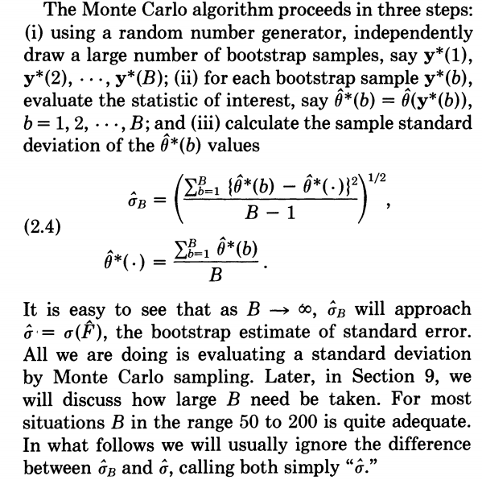
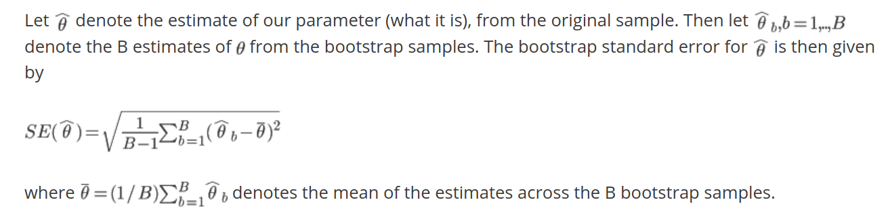

# Bootstrap

The statistic of interest for the original data (e.g: mean, MLE, applied on your **actual data**) is not necessarily equal to the mean of the bootstrap distribution (or *sampling distribution of the statistic*) for the statistic; as seen in [this example][1].

This is described more properly in this [SE answer][2]:

> For statistics that are not linear functions of the data (...) it would be wrong simply to substitute the bootstrap mean for the statistic's value on the data: that is not how bootstrapping works. Instead, by comparing the bootstrap mean to the data statistic we obtain information about the bias of the statistic. This can be used to adjust the original statistic to remove the bias. As such, the bias-corrected estimate thereby becomes an algebraic combination of the original statistic and the bootstrap mean. For more information, look up "BCa" (bias-corrected and accelerated bootstrap) and "ABC".

Th bias-corrected and accelerated bootstrap interval (BCa interval) is explained in detail in [this example][3]:

> The main advantage to the BCa interval is that it corrects for bias and skewness in the distribution of bootstrap estimates. The BCa interval requires that you estimate two parameters. The bias-correction parameter, z0, is related to the proportion of bootstrap estimates that are less than the observed statistic. The acceleration parameter, a, is proportional to the skewness of the bootstrap distribution. You can use the jackknife method to estimate the acceleration parameter.
>
> The bias correction factor is related to the proportion of bootstrap estimates that are less than the observed statistic. The acceleration parameter is proportional to the skewness of the bootstrap distribution.

A Python implementation can be found in the `scikits-bootstrap` [package][4]. An example of its use can be found in [the article mentioned above][3] (it also mentions the Approximate Bootstrap Confidence or `ABC` method).

All these methods are described in `An Introduction to the Bootstrap`, Efron & Tibshirani (1994), Chapter 4.

## The standard deviation of the bootstrap sample is a standard error

In a recent question I made, I got a [comment][5] by AdamO stating that:

> the standard deviation of that bootstrap sample is in fact a standard error

I'm having trouble wrapping my head around this statement. In the article [The bootstrap — or why you should care about uncertainty][6] it is said about this that:

> standard error, which is basically the standard deviation of the statistic

and [Efron & Tibshirani (1986, Vol. 1, No. 1, 54-77, pag 56)][7] state that:

> It is easy to see that as B -> inf, $\hat{\sigma}_B$ (the sample standard
deviation) will approach $\hat{\sigma}=\sigma(\hat{F})$, the bootstrap estimate
of standard error.

Also in the article [The miracle of the bootstrap][8], the SE formula is the SD formula:

___________________________________________________________________________
[1]: https://blogs.sas.com/content/iml/2017/07/10/bootstrap-sasiml.html
[2]: https://stats.stackexchange.com/a/133405/10416
[3]: https://blogs.sas.com/content/iml/2017/07/12/bootstrap-bca-interval.html
[4]: https://github.com/cgevans/scikits-bootstrap
[5]: https://stats.stackexchange.com/questions/408516/bootstrap-and-numerical-optimization-of-statistic/408827?noredirect=1#comment763942_408827
[6]: https://medium.com/@datalesdatales/the-bootstrap-or-why-you-should-care-about-uncertainty-c3fe1a5f36b5
[7]: https://pdfs.semanticscholar.org/b966/6dfce48ea18ef9676297dcc6cb62a85fefde.pdf
[8]: https://thestatsgeek.com/2013/07/02/the-miracle-of-the-bootstrap/