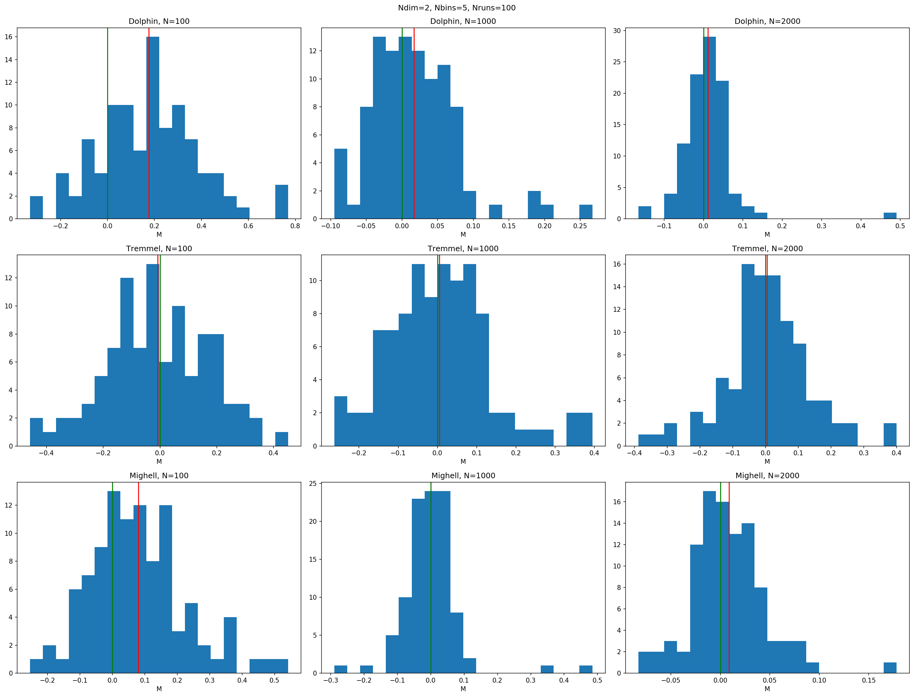
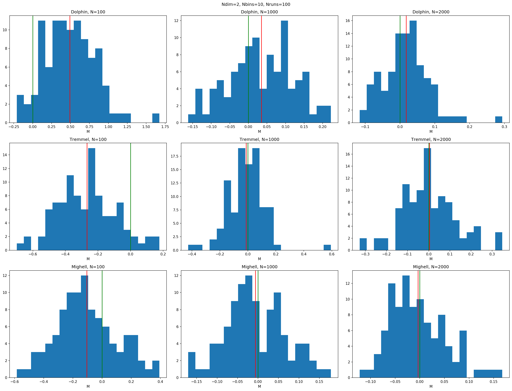
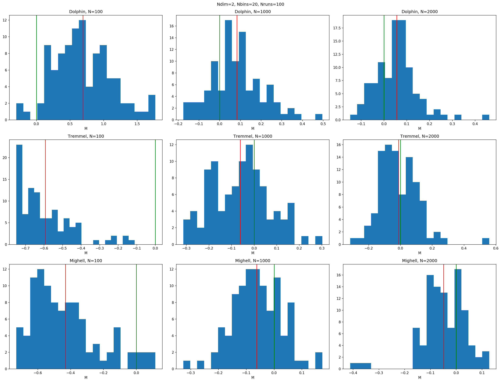
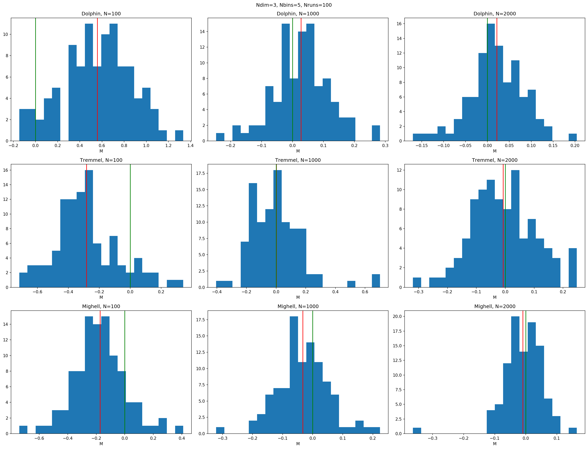
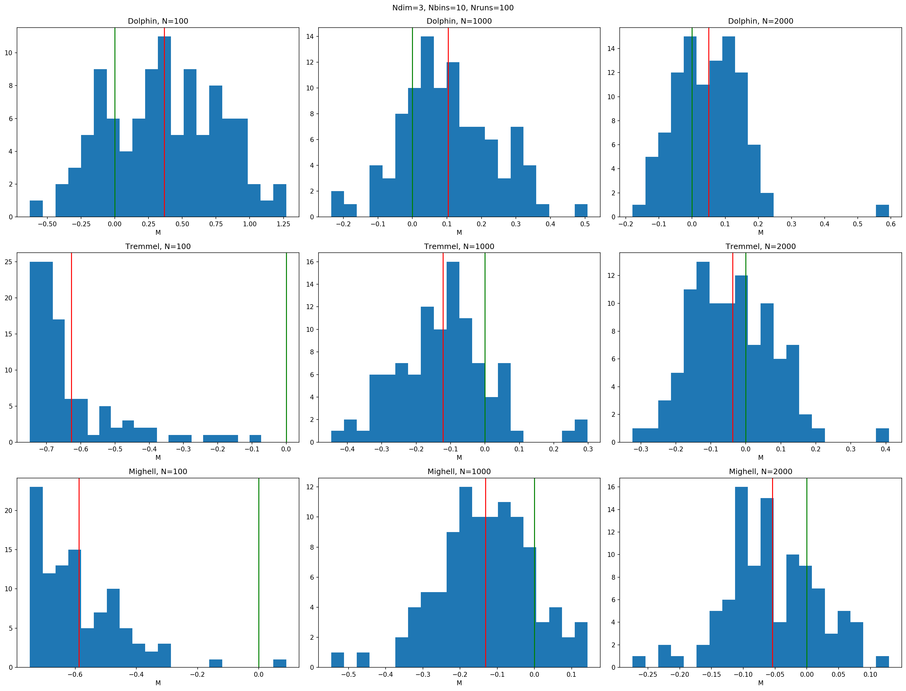
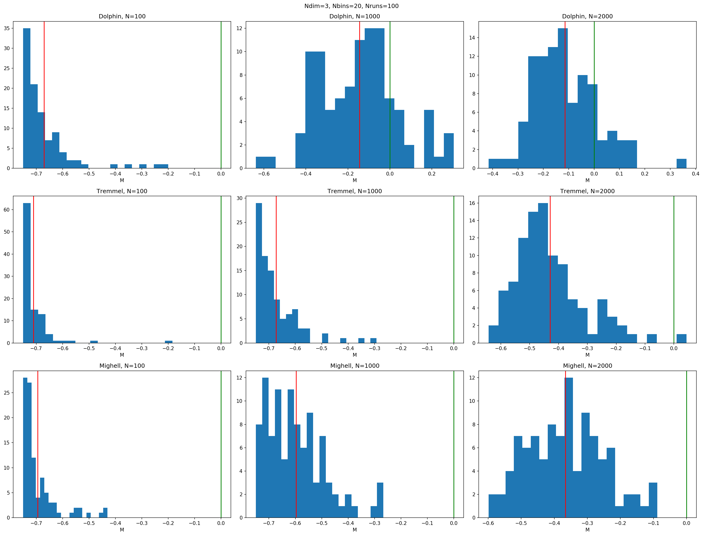

# Likelihood testing

I tested the three binned likelihoods used by `AsteCA`:

1. `mighell`: Mighell (1999) 10.1086/307253
2. `dolphin`: Dolphin (2002) 10.1046/j.1365-8711.2002.05271.x
3. `tremmel`: Tremmel et al. (2013) 10.1088/0004-637X/766/1/19

using different three "masses" (`N`), two dimensions, and three different number of bins.

### 2 dimensions

1. Nb=5

| M        |    100 |   1000 |  2000  |
|:--------:|:------:|:------:|:------:|
| Dolphin  |   0.18 |  0.02  |  0.02  |
| Tremmel  | -0.01* |  0.01  |  0.00* |
| Mighell  |   0.08 |  0.00* |  0.01  |

Winner: **Tremmel**

2. Nb=10

| M        |    100 |   1000 |  2000  |
|:--------:|:------:|:------:|:------:|
| Dolphin  |  0.49  |  0.04  |  0.02  |
| Tremmel  | -0.27  | -0.01* |  0.00* |
| Mighell  | -0.10* | -0.01* |  0.00* |

Winner: **Mighell**

3. Nb=20

| M        |    100 |   1000 |  2000  |
|:--------:|:------:|:------:|:------:|
| Dolphin  |  0.69  |  0.08  |  0.06  |
| Tremmel  | -0.59  | -0.06* | -0.01* |
| Mighell  | -0.43* | -0.06* | -0.05  |

Winner: **Tremmel**

### 3 dimensions

1. Nb=5
------------------------------
M          100    1000    2000
------------------------------
Dolphin   0.56    0.03    0.02
Tremmel  -0.28    0.00*  -0.01* <-- Tremmel
Mighell  -0.17*  -0.03   -0.01* <-- Mighell

2. Nb=10
------------------------------
M          100    1000    2000
------------------------------
Dolphin   0.37*   0.10*   0.05  <-- Dolphin
Tremmel  -0.63   -0.12   -0.04*
Mighell  -0.59   -0.13   -0.05

3. Nb=20
------------------------------
M          100    1000    2000
------------------------------
Dolphin  -0.67*  -0.14*  -0.11* <-- Dolphin
Tremmel  -0.71   -0.67   -0.43
Mighell  -0.69   -0.60   -0.37

