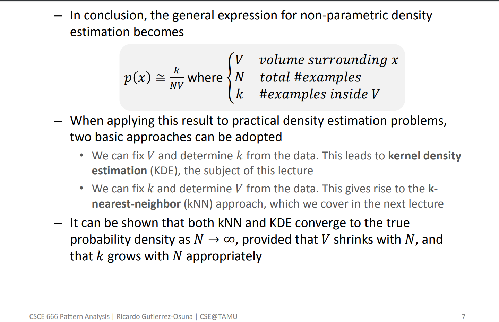
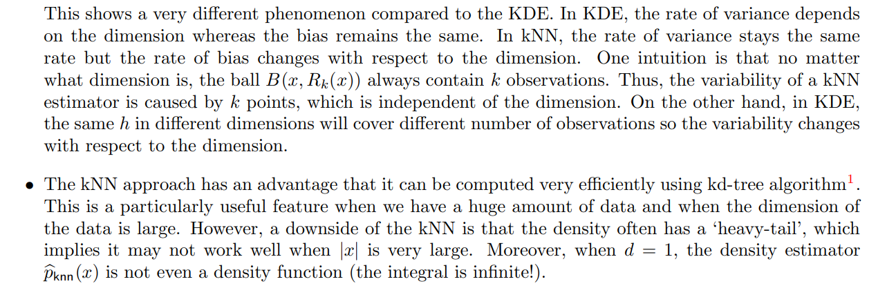

# Probability density estimation

This is a very intuitive way to understand the estimation of an unknown probability density:

from the series of [lectures by Ricardo Gutierrez-Osuna](http://research.cs.tamu.edu/prism/lectures/pr/pr_l7.pdf). It links histograms with KDEs and kNN as probability density estimators.

The course [Introduction to Nonparametric Statistics Winter 2018, Lecture 7: Density Estimation: k-Nearest Neighbor and Basis Approach](http://faculty.washington.edu/yenchic/18W_425/Lec7_knn_basis.pdf) by [Yen-Chi Chen](http://faculty.washington.edu/yenchic/) comments on the differences between KDE and kNN on their dimension dependence:

